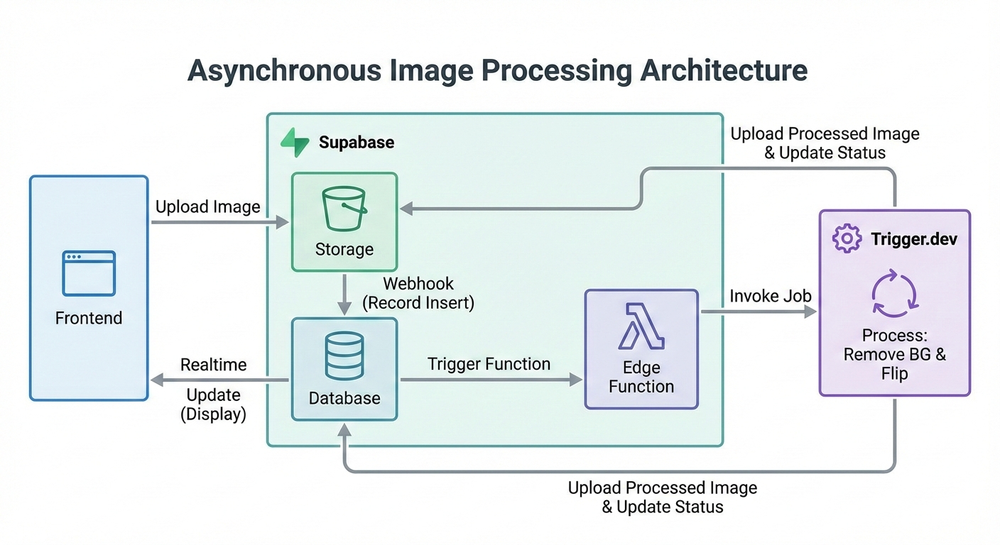

# uplane-take-home

A full-stack application that allows users to upload an image, process it through background removal and horizontal flipping, and then manage the resulting images. Check it out [here](https://uplane-image-processing-8uyd5tgo1-julienandcos-projects.vercel.app/)!


## Repo Structure

```
uplane-take-home/
├── README.md        # Project readme
├── frontend         # Nuxt app lives in here
└── backend
    ├── supabase     # Backend + Database
    └── trigger      # Async tasks
```


## Architecture

### Processing Flow



### Components

| Component | Purpose |
|-----------|---------|
| **Frontend** | [Nuxt 4](https://nuxt.com/) app handling uploads, real-time status updates, and file management |
| **[Supabase](https://supabase.com/) Storage** | Stores original and processed images in the `images` bucket |
| **Supabase Database** | Tracks processing tasks with status (`queued` → `ongoing` → `successful`/`failed`) |
| **Supabase Edge Function** | Webhook listener that triggers async processing on new uploads |
| **[Trigger.dev](https://trigger.dev/)** | Handles (possibly) CPU-intensive and lengthy asynchronous image processing (remove.bg API + transformations (horizontal flip) using [sharp](https://sharp.pixelplumbing.com/)) |

### Data Flow

1. **Upload** — User uploads image → stored in `images/{id}/raw`
2. **Task Creation** — Storage webhook triggers Edge Function Execution
3. **Async Processing** — Edge function creates a row in `image_processing_tasks` and triggers Trigger.dev task. Frontend listens to the status changes of the new row in `image_processing_tasks`.
4. **Image Processing** — Background removal via remove.bg, then horizontal flip via Sharp
5. **Completion** — Processed image stored in `images/{id}/processed`, task status updated
6. **Real-time Update** — Frontend receives status change via Supabase Realtime, displays result
